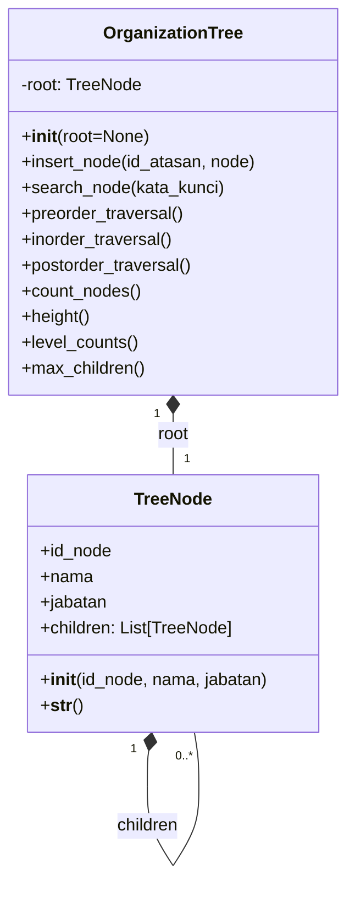

# Class Diagram Proyek 1b — UIN Suska Riau

```mermaid
classDiagram
    class TreeNode {
        +id_node
        +nama
        +jabatan
        +children: List[TreeNode]
        +__init__(id_node, nama, jabatan)
        +__str__()
    }

    class OrganizationTree {
        -root: TreeNode
        +__init__(root=None)
        +insert_node(id_atasan, node)
        +search_node(kata_kunci)
        +preorder_traversal()
        +inorder_traversal()
        +postorder_traversal()
        +count_nodes()
        +height()
        +level_counts()
        +max_children()
    }

    OrganizationTree "1" *-- "1" TreeNode : root
    TreeNode "1" *-- "0..*" TreeNode : children
```

`TreeNode` menyimpan identitas dan hubungan anak. `OrganizationTree` mengelola Root, penambahan, pencarian, traversal, dan analisis ukuran Tree.
